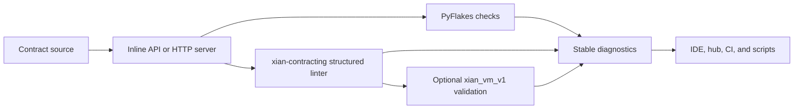

# xian-linter

`xian-linter` is a Python linter specifically for Xian smart contracts. It
combines PyFlakes with authoritative Rust compiler diagnostics exposed by
[`xian-contracting`](../xian-contracting), so rule violations match Python,
WASM/JavaScript, and validator deployment admission.

The published PyPI package is `xian-tech-linter`. The import package and
console command remain `xian_linter` and `xian-linter`. The package can be
used inline (as a dependency in another tool) or as an HTTP server when the
`server` extra is installed.

## Linting Shape



## Quick Start

Install the base package:

```bash
uv add xian-tech-linter
```

Lint inline (lightweight, position-only diagnostics):

```python
from xian_linter import lint_code_inline

errors = lint_code_inline("def transfer():\n    pass\n")
```

Get fully-typed structured results:

```python
from xian_linter import LintErrorModel, lint_code_sync

errors: list[LintErrorModel] = lint_code_sync(
    "@export\ndef transfer():\n    return missing_name\n"
)
```

Validate against the `xian_vm_v1` target:

```bash
uv add "xian-tech-linter[vm]"
```

```python
from xian_linter import lint_code_sync

errors = lint_code_sync(source, mode="xian_vm_v1")
```

Run as a standalone HTTP server:

```bash
uv add "xian-tech-linter[server]"
xian-linter
# defaults to http://127.0.0.1:8000
```

## Principles

- **Linting only.** The package focuses on contract linting; runtime
  execution and contract submission belong elsewhere.
- **One compiler authority, multiple integration modes.** Inline and server
  modes expose the same Rust compiler rules and `xian.*` diagnostic codes.
- **Compatible mode names without duplicated semantics.** Both `python` and
  `xian_vm_v1` use the Rust compiler; the names remain API-compatible. VM mode
  additionally uses the native `xian_vm_core` IR validator when installed.
- **Stable codes and positions.** Tooling (IDE plugins, CI gates, the
  contracting hub) can rely on consistent error codes and source positions
  to render diagnostics.
- **Importable from the root.** `LintErrorModel`, `lint_code_inline`, and
  `lint_code_sync` are importable from the package root — callers do not
  reach into internal modules.
- **Optional server.** The core package is useful as a local linting
  dependency without installing the server extra.

## Key Directories

- `xian_linter/` — package code:
  - `linter.py` — core lint engine combining PyFlakes and the structured
    `xian-contracting` linter.
  - `server.py` — optional FastAPI / ASGI server (`server` extra).
  - `__main__.py` — `xian-linter` console entrypoint.
- `tests/` — inline and server-mode coverage.
- `docs/` — architecture and backlog notes.

## Usage Modes

- **Inline / programmatic** — for in-process linting from another Python
  tool:
  ```python
  from xian_linter import lint_code_inline, lint_code_sync
  inline_errors = lint_code_inline("def transfer():\n    pass\n")
  sync_errors   = lint_code_sync("def transfer():\n    pass\n")
  vm_errors     = lint_code_sync(source, mode="xian_vm_v1")
  ```
- **HTTP server** — for editor / IDE integrations, CI runners, or remote
  linting from web frontends:
  ```bash
  uv add "xian-tech-linter[server]"
  xian-linter
  ```
  Select the VM target with `?mode=xian_vm_v1` on `/lint`, `/lint_base64`, or
  `/lint_gzip`. Install `xian-tech-linter[server,vm]` when the server should
  also run native IR validation through `xian_vm_core`.

  HTTP mode is local by default. Use `XIAN_LINTER_HOST` and
  `XIAN_LINTER_PORT` to change the bind address. Set `XIAN_LINTER_HOST=::1`
  when the server should bind to IPv6 loopback instead of the default IPv4
  loopback address:

  ```bash
  XIAN_LINTER_HOST=::1 XIAN_LINTER_PORT=8000 xian-linter
  ```

  Use a non-loopback host such as `0.0.0.0` only when publishing the service
  deliberately, preferably behind a rate-limited reverse proxy.

  Browser CORS defaults to local origins only. Set
  `XIAN_LINTER_CORS_ORIGINS` to a comma-separated allowlist when a hosted IDE
  or frontend should call the service. The default local-origin regex includes
  `localhost`, `127.0.0.1`, and bracketed IPv6 loopback origins such as
  `http://[::1]:5173`:

  ```bash
  XIAN_LINTER_CORS_ORIGINS=https://ide.example xian-linter
  ```

  Lint transports accept at most 1 MB bodies, while compiler admission accepts
  at most 128 KiB contract source. `/lint_gzip` enforces the transport limit on
  both compressed and decompressed bytes and rejects extreme compression ratios.

Compiler admission also caps statement/expression nodes at 50,000, syntax
depth at 64, total tokens at 100,000, tokens on one logical line at 4,096,
canonical IR JSON at 1 MiB, and contract-handle inference at 512 passes. Limit
failures use stable `xian.limit.*` codes.

## Validation

```bash
uv sync --group dev
uv run ruff check .
uv run ruff format --check .
uv run pytest
```

## Related Docs

- [AGENTS.md](AGENTS.md) — repo-specific guidance for AI agents and contributors
- [docs/README.md](docs/README.md) — index of internal docs
- [docs/ARCHITECTURE.md](docs/ARCHITECTURE.md) — major components and dependency direction
- [docs/BACKLOG.md](docs/BACKLOG.md) — open work and follow-ups
- [docs/RELEASING.md](docs/RELEASING.md) — fail-closed tag and package release process
